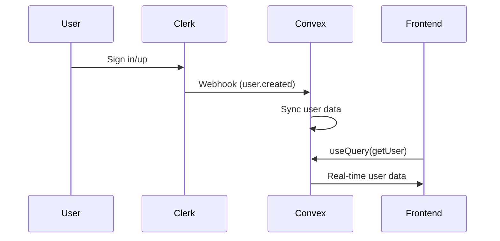
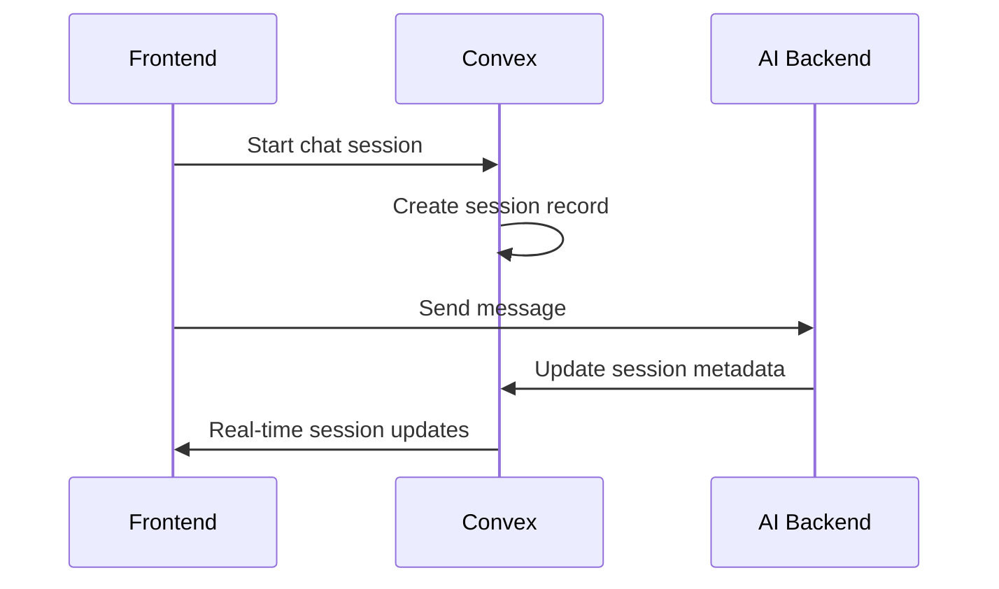

# DataDiver Convex Backend

This directory contains the Convex serverless functions that power DataDiver's real-time features, user management, and session tracking.

## 🏗️ Architecture Overview

Convex serves as DataDiver's real-time database and authentication bridge, handling:

- **User Management** - Syncing Clerk authentication with real-time database
- **Session Tracking** - Managing active chat sessions and user state
- **Payment Integration** - Tracking subscription status and billing events
- **Webhook Processing** - Handling Clerk authentication and billing webhooks
- **Real-time Updates** - Live synchronization for chat and document state

## 📁 File Structure

```
convex/
├── schema.ts              # Database schema definitions
├── users.ts               # User CRUD operations and sync
├── paymentAttempts.ts     # Subscription and billing tracking
├── http.ts                # Webhook handlers for Clerk integration
├── auth.config.ts         # JWT authentication configuration
└── _generated/            # Auto-generated Convex types
```

## 🔧 Key Functions

### User Management (`users.ts`)
```ts
// Sync user from Clerk to Convex
export const upsertFromClerk = internalMutation({
  args: {
    data: v.object({
      id: v.string(),
      first_name: v.optional(v.string()),
      last_name: v.optional(v.string()),
      email_addresses: v.array(v.any()),
    }),
  },
  handler: async (ctx, { data }) => {
    // Sync user data with real-time updates
  }
});
```

### Session Tracking
```ts
// Track active chat sessions
export const createSession = mutation({
  args: { userId: v.string(), metadata: v.optional(v.object({})) },
  handler: async (ctx, args) => {
    // Create new chat session
  }
});
```

### Payment Integration (`paymentAttempts.ts`)
```ts
// Track subscription payments
export const upsertPaymentAttempt = internalMutation({
  args: { data: v.object({}) },
  handler: async (ctx, args) => {
    // Sync payment status from Clerk Billing
  }
});
```

## 🔄 Real-time Data Flow

### Authentication Flow


### Session Management


## 🚀 Development Usage

### Queries (Read Data)
```tsx
// Get current user
const user = useQuery(api.users.getCurrentUser);

// Get active sessions
const sessions = useQuery(api.sessions.getUserSessions, {
  userId: user?.externalId
});
```

### Mutations (Write Data)
```tsx
// Create new session
const createSession = useMutation(api.sessions.create);

// Update user preferences
const updateUser = useMutation(api.users.update);

// Usage in component
const handleStartChat = () => {
  createSession({
    userId: user.externalId,
    metadata: { topic: "document analysis" }
  });
};
```

### Subscriptions (Real-time Updates)
```tsx
// Live session updates
const session = useQuery(api.sessions.get, { sessionId });

// Real-time payment status
const paymentStatus = useQuery(api.paymentAttempts.getLatest, {
  userId: user?.id
});
```

## ⚙️ Configuration

### Environment Variables (Convex Dashboard)
```bash
# Clerk Integration
CLERK_WEBHOOK_SECRET=whsec_your_webhook_secret
NEXT_PUBLIC_CLERK_FRONTEND_API_URL=https://your-clerk-domain.clerk.accounts.dev

# Optional: Database tuning
CONVEX_MAX_QUERY_SIZE=10000
CONVEX_CACHE_TTL=300
```

### JWT Authentication Setup
1. In Clerk Dashboard, create JWT template named "convex"
2. Copy the Issuer URL to `NEXT_PUBLIC_CLERK_FRONTEND_API_URL`
3. Configure the same URL in Convex environment variables

## 🔐 Security Features

### Authentication Rules
```ts
// Example protected query
export const getPrivateData = query({
  args: {},
  handler: async (ctx, args) => {
    const identity = await ctx.auth.getUserIdentity();
    if (!identity) {
      throw new Error("Unauthenticated");
    }
    // Protected logic here
  },
});
```

### Webhook Verification
```ts
// Verify Clerk webhooks with Svix
const webhook = new Webhook(process.env.CLERK_WEBHOOK_SECRET!);
const payload = webhook.verify(body, headers);
```

## 📊 Schema Overview

### Users Table
```ts
users: defineTable({
  name: v.string(),
  externalId: v.string(), // Clerk user ID
  email: v.optional(v.string()),
  preferences: v.optional(v.object({})),
  createdAt: v.number(),
  updatedAt: v.number(),
})
.index("by_external_id", ["externalId"])
```

### Sessions Table
```ts
sessions: defineTable({
  userId: v.string(),
  sessionId: v.string(),
  active: v.boolean(),
  metadata: v.optional(v.object({})),
  createdAt: v.number(),
  lastActivity: v.number(),
})
.index("by_user", ["userId"])
.index("by_session", ["sessionId"])
```

### Payment Attempts Table
```ts
paymentAttempts: defineTable({
  payment_id: v.string(),
  userId: v.id("users"),
  status: v.string(),
  amount: v.optional(v.number()),
  currency: v.optional(v.string()),
  metadata: v.optional(v.object({})),
  createdAt: v.number(),
})
.index("by_user", ["userId"])
.index("by_payment_id", ["payment_id"])
```

## 🛠️ Development Commands

```bash
# Start development database
npx convex dev

# Deploy to production
npx convex deploy

# Open dashboard
npx convex dashboard

# View logs
npx convex logs

# Import/export data
npx convex import --table users data.jsonl
npx convex export --table users
```

## 🔗 Integration with DataDiver

Convex integrates seamlessly with DataDiver's architecture:

- **Frontend** - Real-time UI updates via `useQuery` and `useMutation`
- **AI Backend** - Session state management and user context
- **Authentication** - Clerk user sync and JWT validation
- **Billing** - Subscription status and payment tracking

For more details, see the [main README](../README.md) and [system architecture documentation](../system-architecture-diagram.md).
