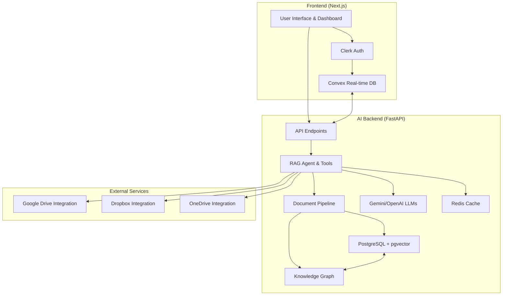

# DataDiver

DataDiver is an intelligent document analysis and Retrieval-Augmented Generation (RAG) platform designed for enterprise-grade document processing, search, and AI-powered insights. It combines advanced vector search, knowledge graph construction, and multi-LLM integration to provide context-aware responses from large document corpora.

## 🎯 Project Purpose

DataDiver enables organizations to upload, process, and query documents using state-of-the-art AI techniques. Key use cases include:
- Legal and compliance document review
- Technical research and knowledge management
- Financial report analysis
- Environmental impact assessments
- Enterprise search and Q&A systems

The platform supports 1M+ token contexts via optimized chunking and hybrid retrieval, ensuring accurate and relevant responses even from massive datasets.

## ✨ Key Features

- **Hybrid Retrieval**: Combines vector similarity, keyword search, and knowledge graph traversal for comprehensive results
- **Semantic Chunking**: Intelligent document splitting that preserves context and meaning
- **Multi-Format Support**: Processes PDF, DOCX, XLSX, PPTX, HTML, CSV, and more with OCR fallback
- **Knowledge Graph Construction**: Extracts entities (companies, technologies, people) and relationships using Graphiti
- **Multi-LLM Integration**: Supports Gemini, OpenAI, Anthropic, Groq, Mistral, and Cohere models
- **Real-time Analytics**: Dashboard with metrics, usage trends, and system health monitoring
- **Secure Authentication**: Clerk integration with Convex for user management and webhooks
- **Serverless Deployment**: Vercel frontend, AWS Lambda/Railway backend with automatic scaling
- **Enterprise Security**: Row-level security, audit logs, and compliance-ready architecture

## 🛠️ Technology Stack

- **Frontend**: Next.js 15 (App Router), TypeScript, Tailwind CSS v4, shadcn/ui, MagicUI animations
- **Backend**: Python FastAPI, PydanticAI agents, asyncpg for PostgreSQL
- **Database**: PostgreSQL with pgvector (embeddings), Convex (real-time/auth), optional Neo4j (graph)
- **AI/ML**: Google Gemini 1.5 Flash (1M context), OpenAI embeddings, Graphiti for KG
- **Auth**: Clerk (JWT, webhooks)
- **Deployment**: Vercel, AWS Lambda, Railway, Docker, Kubernetes
- **Caching**: Redis for sessions and results
- **Monitoring**: Prometheus metrics, structured logging

## 🚀 Quick Start

### Prerequisites
- Node.js 18+
- Python 3.11+
- PostgreSQL 15+ with pgvector extension
- Google Gemini API key
- Clerk account
- Convex account

### 1. Clone and Setup
```bash
git clone https://github.com/your-org/datadiver.git
cd datadiver
```

### 2. Environment Configuration
Copy example env files:
```bash
cp .env.example .env.local  # Frontend
cp api/.env.example api/.env  # Backend
```

Set required variables:
- Frontend: `NEXT_PUBLIC_CLERK_PUBLISHABLE_KEY`, `NEXT_PUBLIC_CONVEX_URL`, `NEXT_PUBLIC_API_BASE`
- Backend: `GOOGLE_API_KEY`, `DATABASE_URL`, `REDIS_URL`

### 3. Database Setup
```sql
-- Enable pgvector
CREATE EXTENSION IF NOT EXISTS vector;

-- Create tables (run migrations or from db_utils.py)
-- See sql/schema.sql for full schema
```

### 4. Install Dependencies
```bash
# Frontend
cd app
npm install

# Backend
cd ../api
pip install -r requirements.txt
```

### 5. Run Development Servers
```bash
# Terminal 1: Frontend
cd app
npm run dev  # http://localhost:3000

# Terminal 2: Backend
cd api
uvicorn main:app --host 0.0.0.0 --port 8058 --reload  # http://localhost:8058

# Terminal 3: Convex (if local dev)
npx convex dev
```

### 6. Ingest Sample Documents
```bash
# Process documents in ./documents/
cd ingestion
python -m ingest --documents ../documents --verbose
```

### 7. Access the Platform
- Dashboard: http://localhost:3000/dashboard
- API Docs: http://localhost:8058/docs
- Health Check: http://localhost:8058/health

## 📖 Usage Examples

### API Chat Request
```bash
curl -X POST http://localhost:8058/chat \
  -H "Content-Type: application/json" \
  -d '{
    "messages": [{"role": "user", "content": "Summarize the key findings from the environmental report"}],
    "session_id": "user-123-session-456",
    "search_type": "hybrid",
    "max_results": 5
  }'
```

### Document Upload
```bash
curl -X POST http://localhost:8058/upload \
  -H "Authorization: Bearer your-clerk-jwt" \
  -F "file=@report.pdf" \
  -F "collection_id=env-reports"
```

### Vector Search
```bash
curl -X POST http://localhost:8058/search/vector \
  -H "Content-Type: application/json" \
  -d '{
    "query": "carbon emissions reduction strategies",
    "top_k": 10,
    "threshold": 0.8
  }'
```

## 🏗️ Architecture Overview

DataDiver follows a microservices architecture with clear separation of concerns:



**Data Flow**:
1. User authenticates via Clerk → Convex syncs user data
2. Upload document → Ingestion pipeline: convert → chunk → embed → store in PG vectors → extract entities/relations to KG
3. Query → Agent: classify domain → hybrid search (vector + graph) → LLM generation with context
4. Response streamed back with analytics tracking

See [docs/architecture.md](architecture.md) for detailed system design.

## 🔧 Development Setup

### Frontend Development
```bash
cd app
npm run dev  # Development server
npm run build  # Production build
npm run lint  # Code quality
```

### Backend Development
```bash
cd api
pip install -r requirements.txt
uvicorn main:app --reload  # Development server
pytest tests/  # Run tests (if implemented)
```

### Database Migrations
```bash
# Using Alembic (if configured)
alembic upgrade head
```

### Ingestion Pipeline
```bash
cd ingestion
python -m ingest --documents ./sample-docs --clean --verbose
```

## 📊 Testing

- **Unit Tests**: Run `pytest` in backend directories
- **Integration Tests**: Test API endpoints with provided curl examples
- **E2E Tests**: Use dashboard to upload/query documents
- **Load Testing**: Use tools like Artillery or Locust for API stress testing

See [docs/testing.md](testing.md) for comprehensive testing strategy.

## 🔒 Security

- Clerk JWT authentication for all protected routes
- Row-level security in PostgreSQL
- Rate limiting on API endpoints
- Input validation with Pydantic
- Secure file upload handling
- Environment-based configuration (dev/prod)

## 🚀 Deployment

Supported platforms:
- **Vercel** (Frontend) + **Railway** (Backend) - Recommended for quick deployment
- **AWS Lambda** (Backend) + **CloudFront** (Frontend)
- **Docker/Kubernetes** - Self-hosted enterprise
- **Replit** - Development and prototyping

See [docs/setup-deployment.md](setup-deployment.md) for step-by-step guides.

## 🤝 Contributing

We welcome contributions! Please follow these guidelines:

1. Fork the repository
2. Create a feature branch (`git checkout -b feature/amazing-feature`)
3. Commit changes (`git commit -m 'Add amazing feature'`)
4. Push to branch (`git push origin feature/amazing-feature`)
5. Open Pull Request

### Code Style
- Frontend: ESLint + Prettier
- Backend: Black + mypy
- Commit messages: Conventional Commits

### Issues
- Bug reports: Use [issue template](https://github.com/your-org/datadiver/issues/new?template=bug_report.md)
- Feature requests: Use [feature template](https://github.com/your-org/datadiver/issues/new?template=feature_request.md)

## 📄 License

This project is licensed under the MIT License - see the [LICENSE](LICENSE) file for details.

## 🙏 Acknowledgments

- [Clerk](https://clerk.com) - Authentication
- [Convex](https://convex.dev) - Real-time database
- [Google Gemini](https://ai.google.dev) - AI models
- [PostgreSQL pgvector](https://github.com/pgvector/pgvector) - Vector search
- [Graphiti](https://github.com/graphiti-org/graphiti) - Knowledge graphs
- [FastAPI](https://fastapi.tiangolo.com) - Backend framework
- [Next.js](https://nextjs.org) - Frontend framework
- [shadcn/ui](https://ui.shadcn.com) - UI components

## 📞 Support

For support, email support@datadiver.ai or join our [Discord community](https://discord.gg/datadiver).

---

⭐ **Star us on GitHub** if DataDiver helps your document analysis workflows!