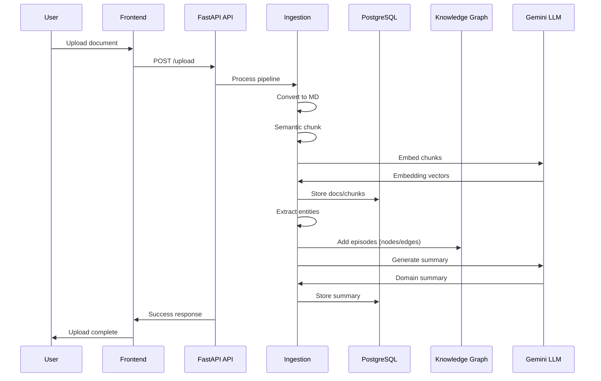
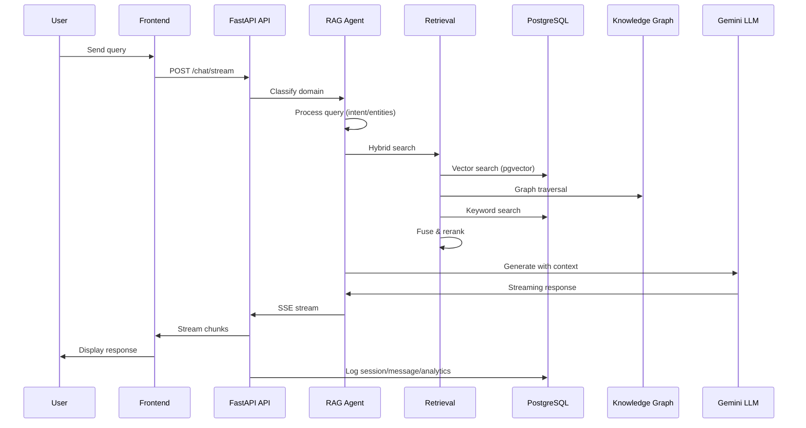

# Architecture

This document provides a comprehensive overview of DataDiver's system architecture, including components, data flows, dependencies, design patterns, scalability considerations, security measures, and performance optimizations.

## 🏗️ System Components

DataDiver is a full-stack AI platform comprising distinct layers for frontend, backend, database, and external services.

### Frontend (Next.js 15)
- **Framework**: Next.js App Router with TypeScript for server-side rendering, static generation, and API routes.
- **UI/UX**: Tailwind CSS v4 (OKLCH colors, responsive utilities), shadcn/ui components (Button, Card, Tabs, etc.), MagicUI for animations (AnimatedBeam, SpotlightCard, NumberTicker), Framer Motion for interactions.
- **State Management**: React hooks (useState, useEffect), Convex React for real-time queries/mutations, Clerk for auth state.
- **Providers**: ThemeProvider (next-themes, forced dark mode), ClerkProvider (auth), ConvexClientProvider (ConvexProviderWithClerk for auth sync).
- **Routing**: Parallel routes ((landing) for marketing, dashboard/ for authenticated pages with sub-routes like /chat, /documents, /analytics).
- **Mobile Optimization**: use-mobile.ts hook (matchMedia for 1024px/768px breakpoints), safe-area insets, touch-manipulation, responsive text (clamp).
- **Key Files**: app/layout.tsx (root layout/metadata/providers), globals.css (Tailwind base/animations), (landing)/page.tsx (hero/features/pricing), dashboard/page.tsx (tabs/charts/metrics with Recharts).

### Backend (Python FastAPI)
- **Framework**: FastAPI for async API with OpenAPI docs (/docs), Pydantic for models/validation.
- **RAG Agent**: PydanticAI agent in agent/agent.py with tools (vector/graph/hybrid search, summarizer, question generator), multi-step retrieval (enhanced_retrieval.py: intent/entity extraction → domain classify → retrieve → fuse).
- **Ingestion Pipeline**: ingestion/ingest.py orchestrates: converters.py (PDF/DOCX/XLSX/HTML/CSV to MD with pdfminer/PyMuPDF/openpyxl, OCR fallback), chunker.py (semantic/simple splitting with LLM fallback), embedder.py (OpenAI/Gemini batch embeddings with cache/retries), graph_builder.py (Graphiti episodes, rule-based entity extraction: companies/tech/people/locations).
- **Database Access**: db_utils.py (asyncpg pool with SSL/timeout, CRUD for sessions/messages/documents/chunks/collections/summaries), graph_utils.py (PG graph client: nodes/edges/facts tables, add_episode/clear).
- **Analytics**: analytics.py (track queries/sessions/usage in PG/Redis).
- **Integrations**: tools.py (Google Drive/Dropbox/OneDrive via APIs).
- **Key Files**: agent/api.py (endpoints: /chat/stream, /search/{vector|graph|hybrid}, /upload, /analytics/*, /integrations/*), main.py (uvicorn server), providers.py (LLM/embed clients: Gemini/OpenAI/Anthropic/Groq/Mistral/Cohere).

### Database Layer
- **Primary (PostgreSQL)**: Asyncpg pool, pgvector for embeddings (cosine similarity indexes). Tables: sessions (id/user_id/created), messages (session_id/content/role), documents (id/title/source/content/metadata/user_id), chunks (document_id/content/embedding/index/metadata/token_count), collections (id/name/user_id), summaries (collection_id/summary/domain), graph_nodes (id/type/properties), graph_edges (source_id/target_id/type/properties), graph_facts (node_id/fact_type/value).
- **Real-time (Convex)**: TypeScript schema for users (name/externalId=Clerk ID, index byExternalId), paymentAttempts (validated schema with indexes by paymentId/userId/payerUserId). Mutations/queries for Clerk sync (upsert/delete), http.ts webhook (/clerk-users-webhook: Svix validation for user.created/updated/deleted, paymentAttempt.updated).
- **Cache (Redis)**: Sessions, query results, summaries (TTL for freshness).
- **Optional Graph (Neo4j)**: For advanced KG queries (not primary, PG tables used instead).

### External Services
- **Auth**: Clerk (JWT, webhooks to Convex for user sync).
- **LLM/Embeddings**: Google Gemini 1.5 Flash (primary, 1M context), OpenAI (embeddings/models), Anthropic Claude, Groq, Mistral, Cohere via unified providers.py.
- **Storage/Integrations**: AWS S3 (optional uploads), Google Drive/Dropbox/OneDrive APIs.
- **Deployment**: Vercel (frontend), AWS Lambda (mangum handler), Railway (gunicorn), Docker/K8s, Replit (dev).

## 🔄 Data Flow

### Document Ingestion
1. Upload (frontend file-upload.tsx → /upload POST multipart).
2. Convert (converters.py: multi-format to MD, normalization, fallbacks).
3. Chunk (chunker.py: semantic splitting on structure/LLM, overlap for context).
4. Embed (embedder.py: batch OpenAI/Gemini, cache, retries, zero-vector fallback).
5. Store (ingest.py: PG documents/chunks with vectors, metadata).
6. Graph Build (graph_builder.py: entity extraction rules/LLM → Graphiti episodes → PG nodes/edges/facts).
7. Summary (summarizer.py: domain-classify → expert prompt → LLM summary, cache in PG).

Mermaid Sequence Diagram:

### Query Processing
1. Chat (/chat/stream POST with messages/session_id/search_type).
2. Classify (document_classifier.py: domain enum via keywords/LLM).
3. Retrieve (enhanced_retrieval.py: query_processor → intent/entities → hybrid tools: vector cosine>0.8 + graph traversal + keyword BM25 → fuse rerank).
4. Generate (agent.py: PydanticAI with prompts.py system prompt, context from retrieval/summaries).
5. Stream (SSE response, track analytics.py metrics).

Mermaid Sequence Diagram:

## 📦 Dependencies

### Frontend (package.json)
- Core: next@15.0.0, react@18, typescript@5
- UI: tailwindcss@4.0.0, @radix-ui/react-*, lucide-react@0.400, clsx@2, tw-merge@2
- Auth/DB: @clerk/nextjs@5, convex@1.12
- Charts/Animations: recharts@2.12, framer-motion@11, @magicui/react@1
- Utils: date-fns@3, sonner@1

### Backend (api/requirements.txt)
- Framework: fastapi==0.115.13, uvicorn==0.34.3, pydantic==2.11.7
- AI/RAG: pydantic-ai==0.3.2, google-generativeai>=0.8.0, openai==1.90.0, anthropic==0.54.0, groq==0.28.0, mistralai==1.8.2, cohere==5.15.0
- DB/Graph: asyncpg==0.30.0, graphiti-core==0.12.4, neo4j==5.28.1 (optional)
- Utils: python-dotenv==1.1.0, PyYAML==6.0.2, tenacity==9.1.2, diskcache==5.6.3
- Deployment: mangum==0.17.0 (AWS), boto3==1.38.41 (S3), httpx==0.28.1 (Vercel)

## 🎨 Design Patterns

- **Async Everywhere**: Python async/await for I/O (DB/LLM/API), Next.js async components.
- **RAG Multi-Step**: Query → classify domain (environmental/financial/etc.) → extract intent/entities/keywords → retrieve (vector+graph+keyword) → rerank/fuse → generate with context/summaries.
- **Entity Extraction**: Hybrid rule-based (predefined lists for companies/tech/people) + LLM fallback in graph_builder.py.
- **Error Resilience**: Fallbacks (simple chunking if semantic fails, zero-vectors if embed error, partial graph saves on timeout), retries/exponential backoff (tenacity), timeouts (env-config per-step/global).
- **Caching**: Redis for sessions/summaries/results (TTL), embedder cache (in-memory hash), Convex real-time for users.
- **Modular Tools**: PydanticAI tools for search/upload/analytics, composable in agent.
- **JSON Prompts**: Efficient LLM calls with structured JSON output for parsing.

## ⚖️ Scalability

- **Horizontal Scaling**: Stateless backend (gunicorn workers 4-8), Vercel/AWS auto-scale, PG read replicas.
- **Database**: PG pooling (min 10/max 20), indexes (cosine on embeddings, B-tree on IDs/user_id), partitioning for large tables (chunks by date/user).
- **LLM**: Batch embeddings (100/chunk), concurrent summaries (8), provider rotation on rate limits.
- **Ingestion**: Async pipeline with watchdog/heartbeats, configurable concurrency, queue for large uploads.
- **Frontend**: Next.js ISR/SSG for landing, Convex subscriptions for real-time dashboard updates.
- **Limits**: Max file 200MB, concurrent requests 100, request timeout 300s, upload 600s.

## 🔒 Security

- **Authentication**: Clerk JWT (externalId sync to Convex/PG), middleware validation on protected routes (/dashboard requires user).
- **Authorization**: PG RLS (policies on user_id for documents/chunks/sessions), Convex internal mutations.
- **Input Validation**: Pydantic models (ChatRequest, SearchRequest), file type/size checks.
- **CORS**: Origins limited to frontend domain, credentials true for auth.
- **Secrets**: Env vars (dotenv), no hardcode, Clerk webhook Svix signature verification.
- **Data Protection**: HTTPS enforced, PG SSL, Redis ACL, upload sanitization (no exec), audit logs in analytics.
- **Rate Limiting**: SlowAPI limiter (10/min chat), IP-based.
- **Compliance**: GDPR-ready (user data isolation), no PII in embeddings.

## 🚀 Performance

- **1M Context Optimization**: Chunk overlap 200, semantic splitting preserves context, summaries for collections (domain-expert prompts, cache verification).
- **Query Speed**: Hybrid search <2s avg (vector cosine threshold 0.8, graph traversal limited depth), batch retrieval.
- **Ingestion**: Parallel chunk/embed (asyncio), timeouts (20s init, 300s graph), watchdog for hangs.
- **Monitoring**: /health (DB/LLM/Redis checks), Prometheus metrics (request duration/count, processing time), structured JSON logs.
- **Bottlenecks Mitigated**: Embed cache (hash collisions avoided), PG indexes (ivfflat for vectors), Redis for hot queries.

For module breakdowns, see [docs/modules.md](modules.md). For API specs, see [docs/api.md](api.md). For deployment, see [docs/setup-deployment.md](setup-deployment.md).