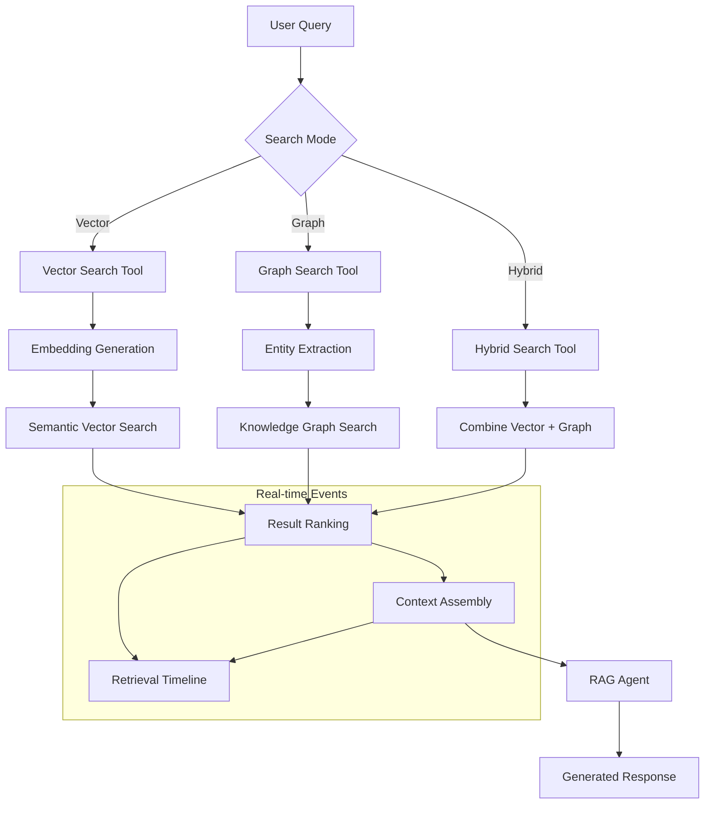

# DataDiver RAG System Architecture

This document explains how the RAG chat and summary functions work in the DataDiver application.

## Overview

The DataDiver system is a comprehensive RAG (Retrieval-Augmented Generation) platform built with Next.js frontend and FastAPI backend, featuring intelligent document analysis, chat interface, and automated summarization capabilities.

## High-Level Architecture


## RAG Chat System Flow

### 1. User Interaction Flow


### 2. Search Modes & Components

#### Enhanced Retrieval System (`agent/enhanced_retrieval.py`)



### 3. Chat Interface Features

#### Core Components (`app/dashboard/chat/page.tsx`)

- **Streaming Response**: Real-time text generation with WebSocket support
- **Source Citations**: Automatic source linking with relevance scores
- **Confidence Metrics**: Multi-dimensional confidence scoring (accuracy, reliability, completeness)
- **Context Filtering**: Collection and document-based filtering
- **Suggested Questions**: Dynamic question generation based on document content
- **Retrieval Timeline**: Real-time visualization of search and retrieval steps

#### Message Flow Architecture


## Summary System Architecture

### 1. DBR Summarizer Overview (`agent/summarizer.py`)

The summarization system provides intelligent, hierarchical document analysis with domain expertise and RAG context integration.


### 2. Hierarchical Processing

#### Batch Processing Strategy


### 3. Domain Classification & Expert Analysis

#### Document Classifier (`agent/document_classifier.py`)


### 4. Summary Output Structure

#### Structured JSON Response

```json
{
  "document_id": "uuid",
  "document_title": "Document Name",
  "summary_type": "comprehensive|executive|financial|operational",
  "generated_at": "2024-timestamp",
  "summary": {
    "executive_overview": "High-level summary (≤180 words)",
    "key_metrics": {
      "revenue": "numeric_value",
      "growth_rate": "percentage",
      "custom_kpis": "domain_specific_metrics"
    },
    "major_highlights": [
      "Key finding 1",
      "Key finding 2",
      "Key finding N"
    ],
    "challenges_and_risks": [
      "Risk factor 1",
      "Challenge 2"
    ],
    "opportunities_and_recommendations": [
      "Recommendation 1",
      "Opportunity 2"
    ],
    "conclusion": "Overall outlook"
  },
  "domain_classification": {
    "domain": "financial|environmental|technical|legal|general",
    "confidence": 0.95,
    "reasoning": "Classification rationale",
    "keywords": ["relevant", "domain", "keywords"]
  },
  "metadata": {
    "total_chunks": 150,
    "processing_time": 45.2,
    "verification": {
      "overall_confidence": 0.92,
      "support_ratio": 0.88,
      "numeric_match_ratio": 0.94,
      "extraction_quality": 0.89
    }
  }
}
```

### 5. Verification & Confidence System


## Integration Points

### 1. Database Layer

#### Vector Database Operations
- **Document Indexing**: Automatic embedding generation for uploaded documents
- **Chunk Storage**: Hierarchical chunk storage with metadata
- **Similarity Search**: Semantic search using embeddings
- **Collection Management**: Organized document grouping

#### Graph Database Integration
- **Entity Extraction**: Named entity recognition and relationship mapping
- **Knowledge Graph**: Connected information representation
- **Graph Queries**: Relationship-based information retrieval

### 2. Real-time Features

#### WebSocket Communication
- **Streaming Responses**: Real-time text generation
- **Retrieval Events**: Live search and processing updates
- **Progress Tracking**: Job status and completion tracking

#### Caching Strategy
- **Summary Cache**: Persistent storage of generated summaries
- **Context Cache**: Temporary storage of retrieval results
- **Session Management**: User session state preservation

### 3. API Endpoints

#### Core RAG Endpoints (`agent/api.py`, `agent/api_enhanced.py`)

```
POST /chat/stream          # Streaming chat interface
GET  /documents            # Document listing and management
POST /documents/upload     # Document upload and processing
GET  /collections          # Collection management
POST /summarize            # Document summarization
GET  /summary/job/{id}     # Summary job status
GET  /health               # System health check
```

## Performance Optimizations

### 1. Concurrency & Parallelization
- **Parallel Batch Processing**: Multiple document sections processed simultaneously
- **Async Operations**: Non-blocking I/O for database and API calls
- **Semaphore Limiting**: Controlled concurrency to prevent resource exhaustion

### 2. Token Management
- **Dynamic Batching**: Intelligent chunk grouping based on content size
- **Context Window Optimization**: Efficient use of model context limits
- **Response Streaming**: Real-time response generation

### 3. Caching & Storage
- **Multi-level Caching**: Summary cache, context cache, session cache
- **Incremental Updates**: Progressive result building
- **Efficient Retrieval**: Optimized database queries and indexing

This architecture enables sophisticated document understanding, intelligent question answering, and comprehensive summarization with real-time feedback and high accuracy through verification systems.